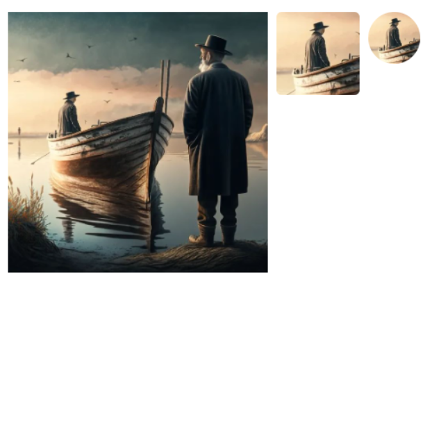

# Cropper image
With this plugin, you can crop and select the desired area of any image, then save both the full picture and the cropped picture.
- Adaptive layout up to 320px;
- Cross-browser layout;
- jQuery functionality;
- Styled scss preprocessor;
- BEM methodology was used for layout;

Online example: https://viktorcoi.github.io/cropper-image/
## Screenshots
<table width="100" align="center">
    <td align="center">
        
         1
    </td>
    <td align="center">
        
         2
    </td>
    <td align="center">
        
         3
    </td>
</table>
